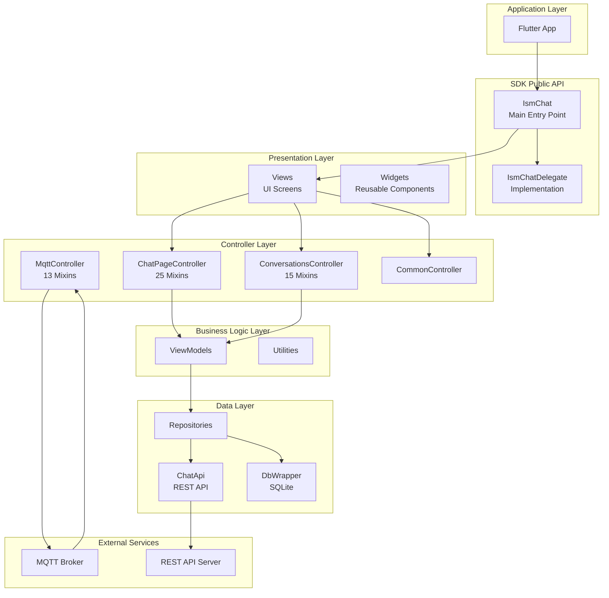
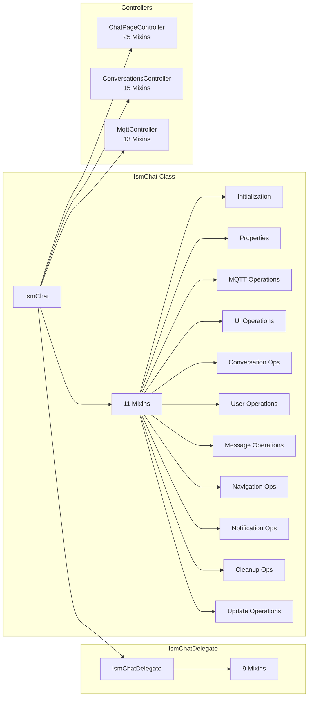
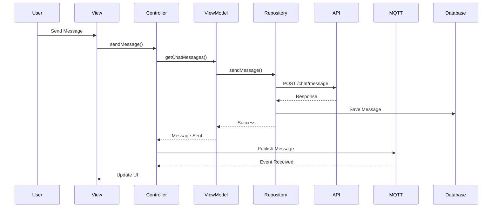
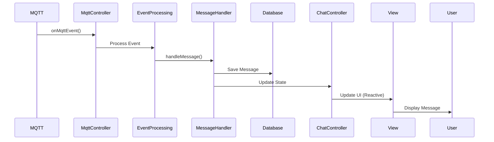
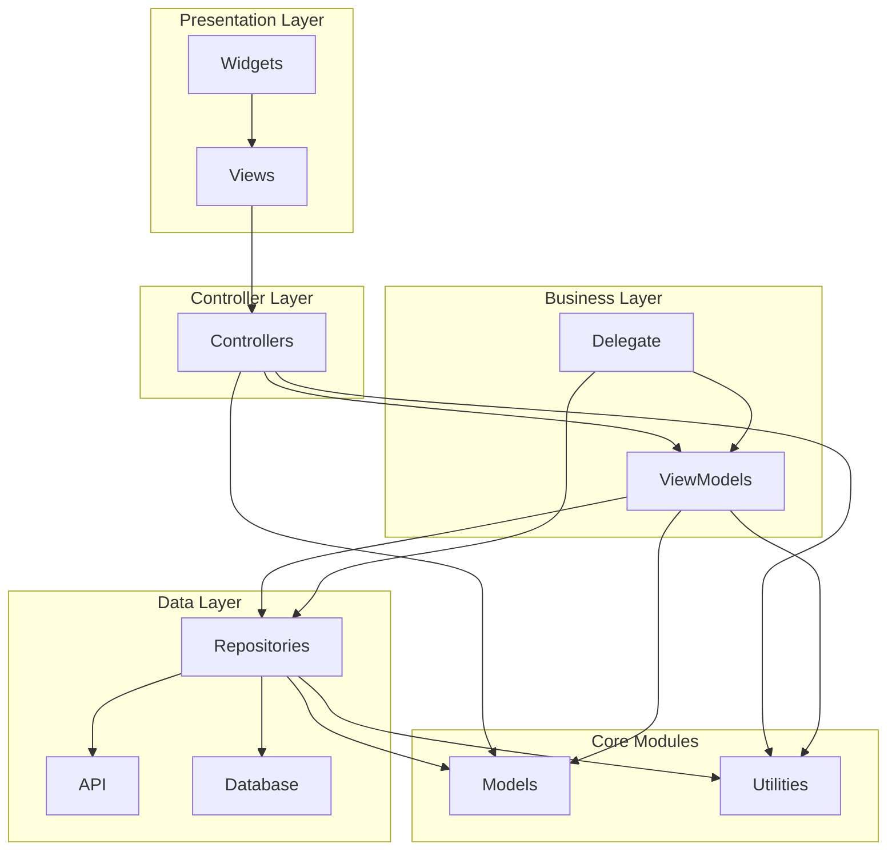
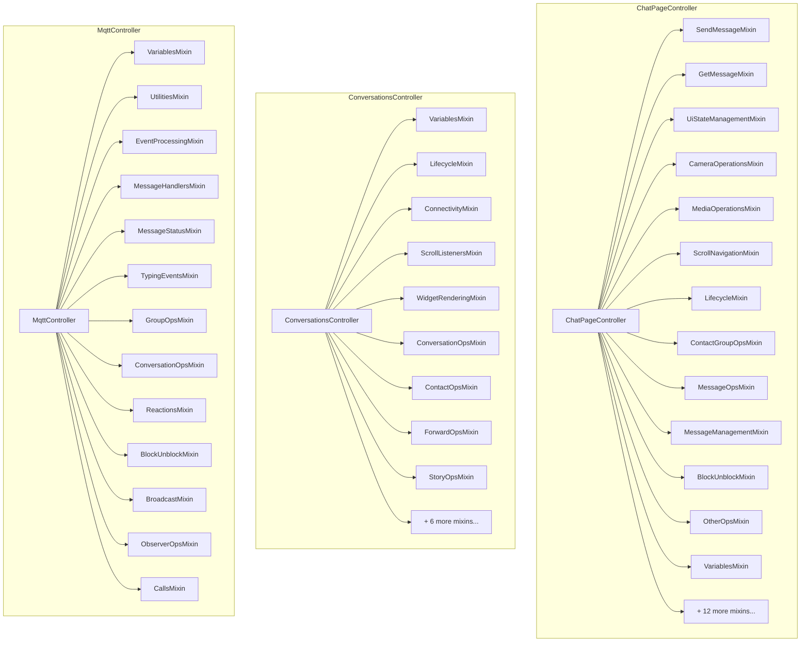
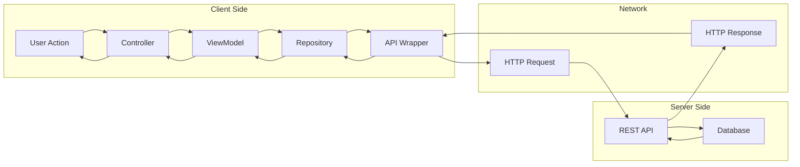
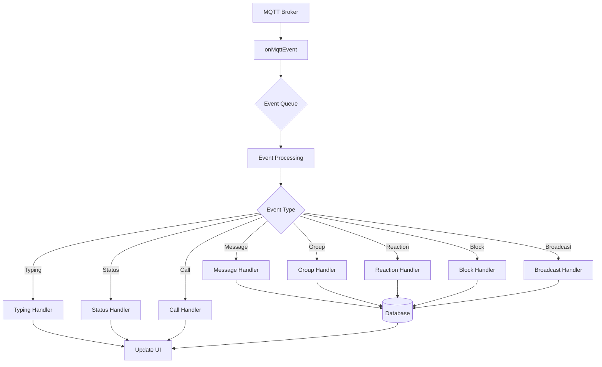
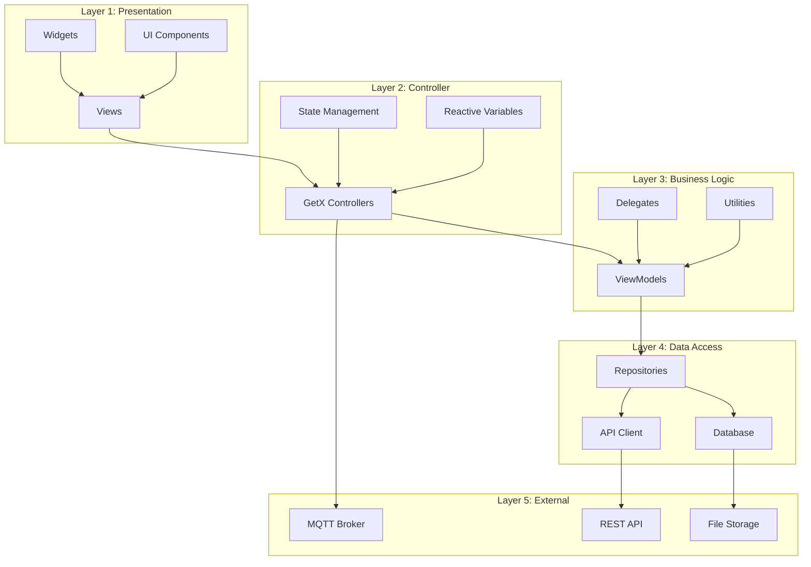
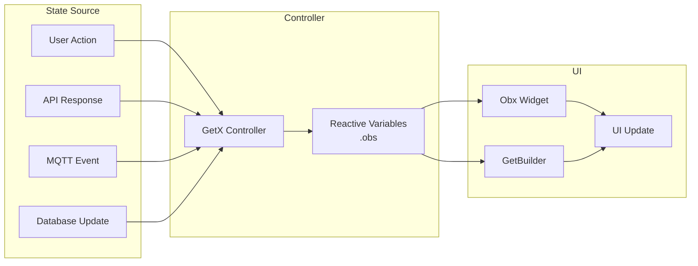

# Architectural Diagrams

**Last Updated:** January 21, 2026

This document contains visual architectural diagrams for the Isometrik Chat Flutter SDK. These diagrams use Mermaid syntax and can be rendered in most modern markdown viewers (GitHub, GitLab, VS Code with Mermaid extension, etc.).

## Table of Contents

1. [System Architecture Overview](#1-system-architecture-overview)
2. [Component Relationship Diagram](#2-component-relationship-diagram)
3. [Data Flow - Message Sending](#3-data-flow---message-sending)
4. [Data Flow - Message Receiving](#4-data-flow---message-receiving)
5. [Module Dependencies](#5-module-dependencies)
6. [Controller Composition](#6-controller-composition-mixin-pattern)
7. [Request/Response Flow](#7-requestresponse-flow)
8. [MQTT Event Processing Flow](#8-mqtt-event-processing-flow)
9. [Layered Architecture Detail](#9-layered-architecture-detail)
10. [State Management Flow](#10-state-management-flow)

---

## 1. System Architecture Overview

This diagram shows the high-level architecture of the SDK, including all major layers and their relationships.

**Key Points:**
- Clear separation of concerns across layers
- Controllers use mixins for composition
- Data layer abstracts API and database access
- MQTT provides real-time communication

---

## 2. Component Relationship Diagram

This diagram shows how the main SDK components relate to each other and their internal composition.

**Key Points:**
- `IsmChat` composes 11 mixins for different operation types
- `IsmChatDelegate` handles implementation details
- Controllers use extensive mixin composition

---

## 3. Data Flow - Message Sending

This sequence diagram shows the complete flow when a user sends a message.

**Key Points:**
- Request flows through all layers
- Message is saved to database for offline support
- MQTT publishes for real-time delivery
- UI updates reactively

---

## 4. Data Flow - Message Receiving

This sequence diagram shows how incoming messages are processed.

**Key Points:**
- MQTT events trigger processing
- Messages are saved to database
- State updates trigger reactive UI updates
- No manual UI refresh needed

---

## 5. Module Dependencies

This diagram shows dependencies between different modules.

**Key Points:**
- Clear dependency direction (top to bottom)
- Core modules (Models, Utilities) are shared
- No circular dependencies
- Clean separation of concerns

---

## 6. Controller Composition (Mixin Pattern)

This diagram shows how controllers use mixins for composition.

**Key Points:**
- Each controller composes multiple focused mixins
- Mixins follow Single Responsibility Principle
- Easy to add/remove functionality
- Clear organization by domain

---

## 7. Request/Response Flow

This diagram shows the request/response cycle for API calls.

**Key Points:**
- Clear request path through layers
- Response flows back through same layers
- Repository abstracts network details
- Error handling at each layer

---

## 8. MQTT Event Processing Flow

This diagram shows how MQTT events are processed and routed.

**Key Points:**
- Events are queued for processing
- Event type determines handler
- Database updates for persistent events
- UI updates for real-time feedback

---

## 9. Layered Architecture Detail

This diagram provides detailed view of each layer and its components.

**Key Points:**
- Five distinct layers
- Each layer has specific responsibilities
- Dependencies flow downward only
- External services at the bottom

---

## 10. State Management Flow

This diagram shows how GetX reactive state management works.

**Key Points:**
- Multiple state sources
- Reactive variables (.obs) hold state
- UI widgets automatically update
- No manual setState() needed

---

## Rendering Diagrams

These diagrams use Mermaid syntax. To view them:

1. **GitHub/GitLab**: Automatically rendered in markdown files
2. **VS Code**: Install "Markdown Preview Mermaid Support" extension
3. **Online**: Use [Mermaid Live Editor](https://mermaid.live/)
4. **Documentation Sites**: Most support Mermaid natively

## Related Documentation

- [ARCHITECTURE.md](../ARCHITECTURE.md) - Complete architecture documentation
- [MODULE_CONTROLLERS.md](./MODULE_CONTROLLERS.md) - Controllers documentation
- [MODULE_DATA.md](./MODULE_DATA.md) - Data layer documentation

