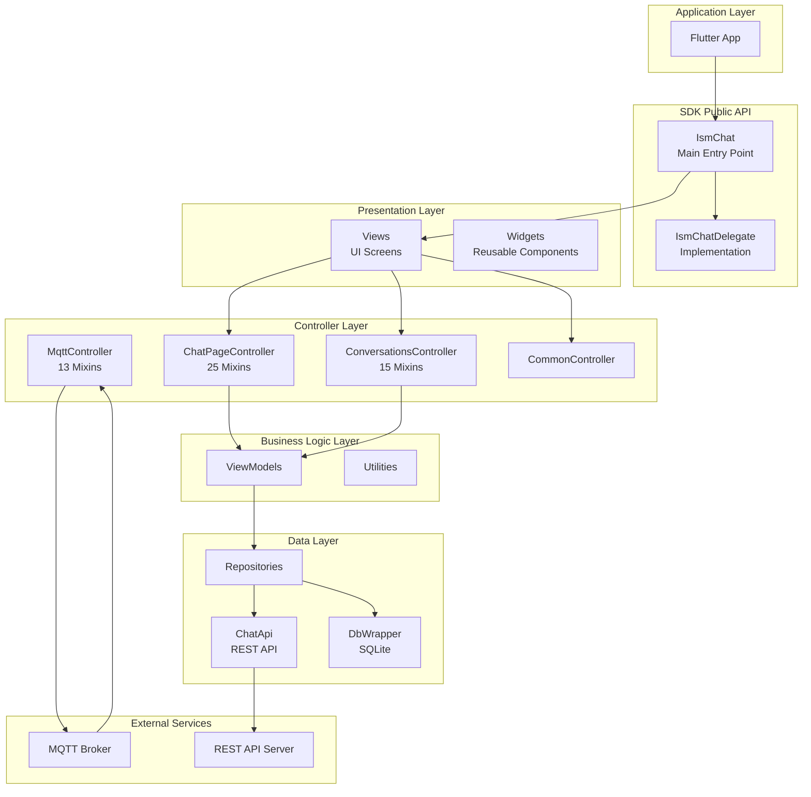
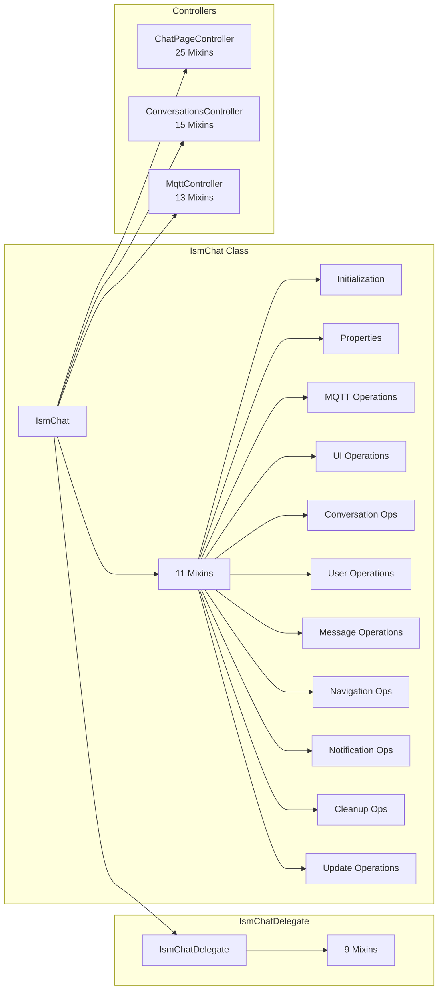
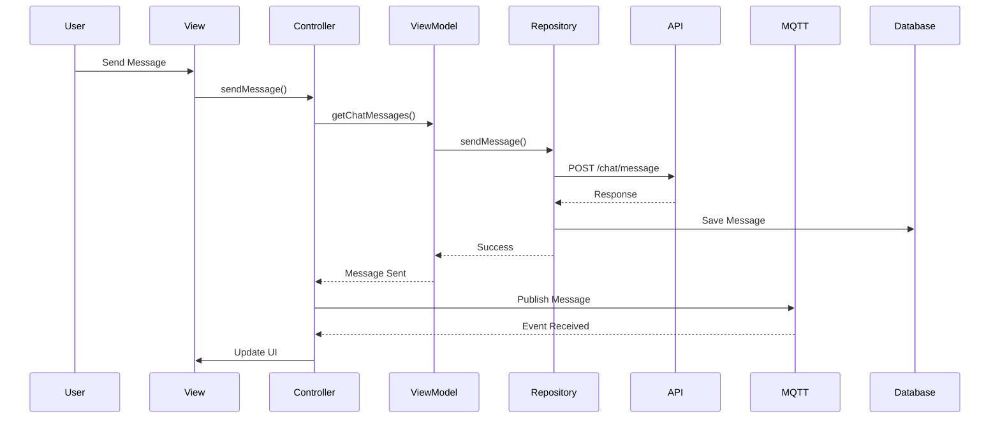
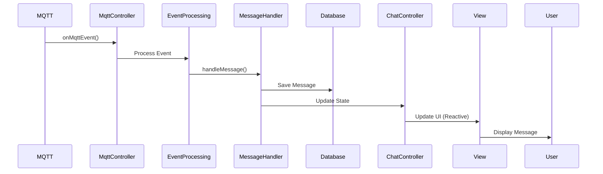
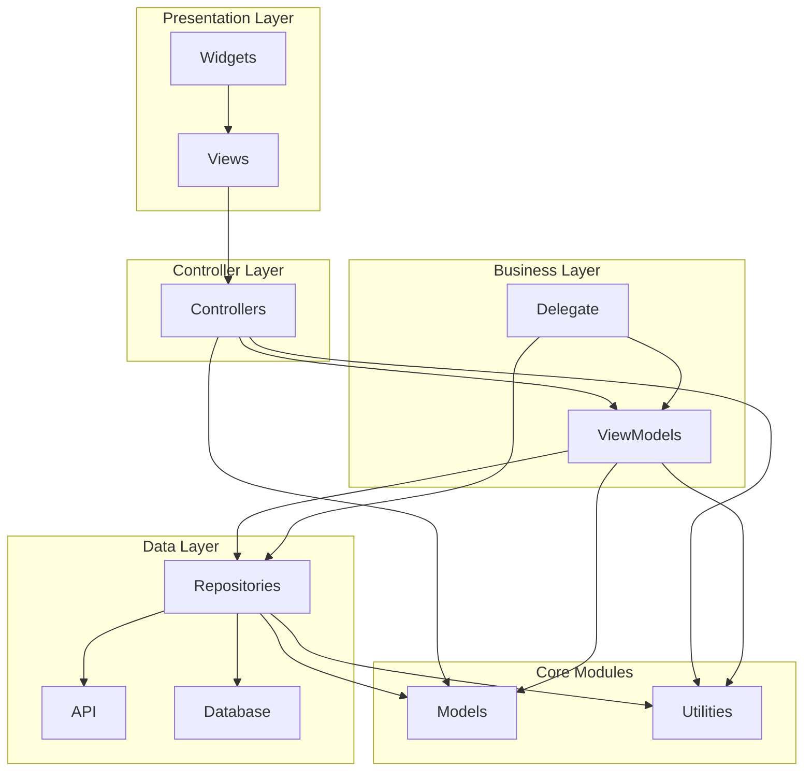
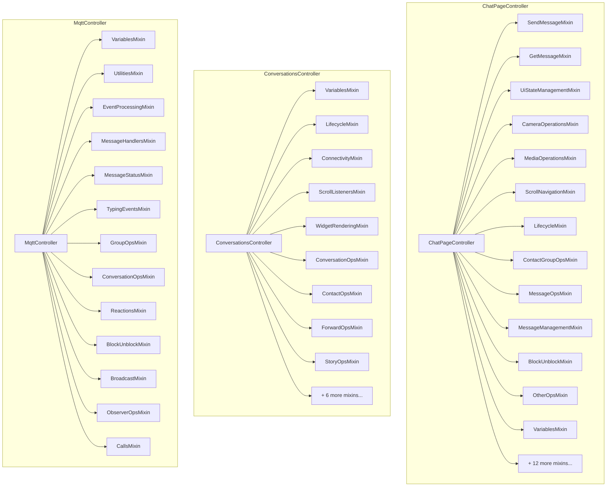
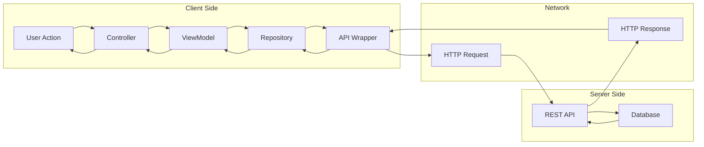
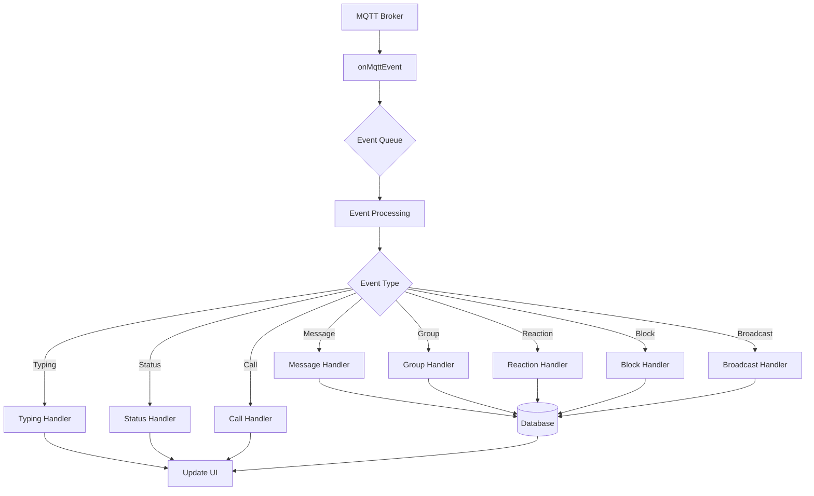
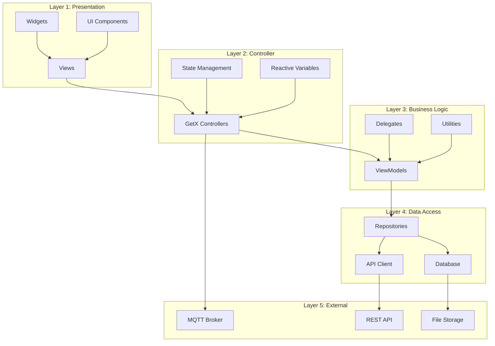
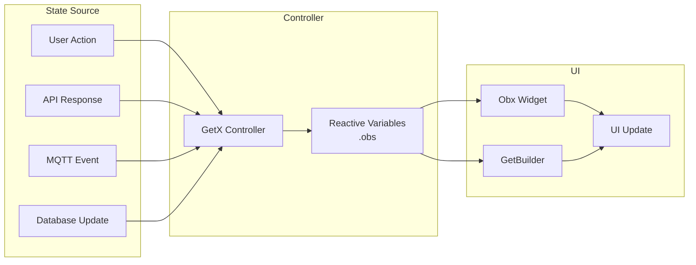

# Isometrik Chat Flutter SDK - Architecture Documentation

**Version:** 1.0  
**Last Updated:** January 21, 2026  
**Status:** Current Architecture (Post-Refactoring)

## Table of Contents

1. [Overview](#overview)
2. [Architectural Diagrams](#architectural-diagrams)
3. [Architectural Patterns](#architectural-patterns)
4. [Module Structure](#module-structure)
5. [Core Components](#core-components)
6. [Data Flow](#data-flow)
7. [Design Patterns](#design-patterns)
8. [Refactoring Improvements](#refactoring-improvements)
9. [Key Architectural Decisions](#key-architectural-decisions)

---

## Architectural Diagrams

### 1. System Architecture Overview



### 2. Component Relationship Diagram



### 3. Data Flow Diagram - Message Sending



### 4. Data Flow Diagram - Message Receiving



### 5. Module Dependencies



### 6. Controller Composition (Mixin Pattern)



### 7. Request/Response Flow



### 8. MQTT Event Processing Flow



### 9. Layered Architecture Detail



### 10. State Management Flow



---

## Overview

The Isometrik Chat Flutter SDK is a comprehensive chat solution built using Flutter and following modern software architecture principles. The SDK provides real-time messaging, group chat, file sharing, and various chat-related features.

### Architecture Principles

- **Separation of Concerns**: Each module has a single, well-defined responsibility
- **Modularity**: Code is organized into focused, reusable modules
- **Maintainability**: Large files have been refactored into smaller, manageable components
- **Testability**: Clear boundaries between components enable easier testing
- **Scalability**: Architecture supports future feature additions

### Technology Stack

- **Framework**: Flutter (Dart)
- **State Management**: GetX (Reactive state management)
- **Real-time Communication**: MQTT (via mqtt_helper package)
- **Database**: Local SQLite database (via db_wrapper)
- **Network**: HTTP/REST API (via chat_api)

---

## Architectural Patterns

### 1. Layered Architecture

The SDK follows a layered architecture with clear separation:

```
┌─────────────────────────────────────────┐
│         Presentation Layer              │
│  (Views, Widgets, UI Components)        │
└─────────────────────────────────────────┘
                    ↓
┌─────────────────────────────────────────┐
│         Controller Layer                │
│  (GetX Controllers, ViewModels)         │
└─────────────────────────────────────────┘
                    ↓
┌─────────────────────────────────────────┐
│         Business Logic Layer            │
│  (Delegates, Mixins, Utilities)          │
└─────────────────────────────────────────┘
                    ↓
┌─────────────────────────────────────────┐
│         Data Layer                      │
│  (Repositories, API, Database)           │
└─────────────────────────────────────────┘
```

### 2. Mixin Pattern (Composition over Inheritance)

The SDK extensively uses Dart mixins to compose functionality:

- **Benefits**:
  - Code reuse without deep inheritance hierarchies
  - Single Responsibility Principle (each mixin has one purpose)
  - Easy to test and maintain
  - Flexible composition

- **Implementation**:
  - Mixins are `part of` the main class/library
  - Main classes use `with` clause to compose multiple mixins
  - Each mixin focuses on a specific domain (e.g., MQTT operations, UI operations)

### 3. Delegate Pattern

The `IsmChat` class uses a delegate (`IsmChatDelegate`) to offload implementation:

- **Purpose**: Separates public API from implementation details
- **Benefits**: 
  - Clean public interface
  - Implementation can be swapped or extended
  - Easier testing and mocking

---

## Module Structure

### Directory Organization

```
lib/
├── isometrik_chat_flutter.dart          # Main SDK entry point (80 lines)
├── delegate/                             # Delegate implementation (9 mixins)
│   ├── isometrik_chat_flutter_delegate.dart
│   ├── delegate_initialization.dart
│   ├── delegate_mqtt.dart
│   ├── delegate_ui.dart
│   ├── delegate_conversation.dart
│   ├── delegate_user.dart
│   ├── delegate_message.dart
│   ├── delegate_navigation.dart
│   ├── delegate_notification.dart
│   └── delegate_cleanup.dart
├── mixins/                               # IsmChat mixins (11 mixins)
│   ├── initialization.dart
│   ├── properties.dart
│   ├── mqtt_operations.dart
│   ├── ui_operations.dart
│   ├── conversation_operations.dart
│   ├── user_operations.dart
│   ├── message_operations.dart
│   ├── navigation_operations.dart
│   ├── notification_operations.dart
│   ├── cleanup_operations.dart
│   └── update_operations.dart
└── src/
    ├── app/                              # Application setup
    ├── controllers/                      # GetX Controllers
    │   ├── chat_page/                    # Chat page controller + 25 mixins
    │   ├── chat_conversations/           # Conversations controller + 15 mixins
    │   ├── mqtt/                         # MQTT controller + 13 mixins
    │   ├── chat_broadcast/
    │   └── common/
    ├── models/                           # Data models
    ├── views/                            # UI screens
    ├── widgets/                          # Reusable widgets
    ├── repositories/                     # Data access layer
    ├── data/                             # Database & network
    ├── utilities/                        # Helper functions
    ├── view_models/                      # View models
    └── res/                              # Resources (colors, strings, etc.)
```

---

## Core Components

### 1. IsmChat (Main Entry Point)

**Location**: `lib/isometrik_chat_flutter.dart`

**Purpose**: Public API for the SDK

**Structure**:
- **Size**: 80 lines (reduced from 1,349 lines - 94.1% reduction)
- **Composition**: Uses 11 mixins via `with` clause
- **Pattern**: Facade pattern - provides simple interface to complex subsystem

**Mixins**:
1. `IsmChatInitializationMixin` - SDK initialization
2. `IsmChatPropertiesMixin` - Configuration getters
3. `IsmChatMqttOperationsMixin` - MQTT operations
4. `IsmChatUiOperationsMixin` - UI state management
5. `IsmChatConversationOperationsMixin` - Conversation CRUD
6. `IsmChatUserOperationsMixin` - User management
7. `IsmChatMessageOperationsMixin` - Message operations
8. `IsmChatNavigationOperationsMixin` - External navigation
9. `IsmChatNotificationOperationsMixin` - Push notifications
10. `IsmChatCleanupOperationsMixin` - Resource cleanup
11. `IsmChatUpdateOperationsMixin` - Chat page updates

### 2. IsmChatDelegate

**Location**: `lib/delegate/isometrik_chat_flutter_delegate.dart`

**Purpose**: Implementation layer for `IsmChat`

**Structure**:
- **Size**: 47 lines (reduced from 1,076 lines - 95.6% reduction)
- **Composition**: Uses 9 mixins
- **Pattern**: Delegate pattern

**Mixins**:
1. `IsmChatDelegateInitializationMixin`
2. `IsmChatDelegateMqttMixin`
3. `IsmChatDelegateUiMixin`
4. `IsmChatDelegateConversationMixin`
5. `IsmChatDelegateUserMixin`
6. `IsmChatDelegateMessageMixin`
7. `IsmChatDelegateNavigationMixin`
8. `IsmChatDelegateNotificationMixin`
9. `IsmChatDelegateCleanupMixin`

### 3. Controllers (GetX)

#### 3.1 Chat Page Controller

**Location**: `lib/src/controllers/chat_page/chat_page_controller.dart`

**Size**: 98 lines (reduced from 2,038 lines - 95.2% reduction)

**Composition**: 25 mixins organized by functionality:
- **Message Operations**: send_message, get_message, message_operations
- **UI Management**: ui_state_management, scroll_navigation
- **Media**: camera_operations, media_operations
- **Lifecycle**: lifecycle_initialization
- **Utilities**: utility_methods, contact_group_operations
- **And more...**

#### 3.2 Conversations Controller

**Location**: `lib/src/controllers/chat_conversations/chat_conversations_controller.dart`

**Size**: 56 lines (reduced from 1,989 lines - 97.2% reduction)

**Composition**: 15 mixins:
- Variables, lifecycle, connectivity
- Conversation operations, search, filtering
- Group operations, story operations
- And more...

#### 3.3 MQTT Controller

**Location**: `lib/src/controllers/mqtt/mqtt_controller.dart`

**Composition**: Uses `IsmChatMqttEventMixin` which is composed of 13 sub-mixins:
- Variables, utilities, event processing
- Message handlers, message status
- Typing events, group operations
- Conversation operations, reactions
- Block/unblock, broadcast, observer operations, calls

### 4. Data Layer

#### 4.1 Repositories

**Location**: `lib/src/repositories/`

**Purpose**: Abstract data access

**Components**:
- `ChatPageRepository` - Message operations
- `ChatConversationsRepository` - Conversation operations
- `MqttRepository` - MQTT operations
- `ChatBroadcastRepository` - Broadcast operations
- `CommonRepository` - Shared operations

#### 4.2 Database

**Location**: `lib/src/data/database/`

**Components**:
- `DbWrapper` - Database abstraction
- SQLite database for local storage

#### 4.3 Network

**Location**: `lib/src/data/network/`

**Components**:
- `ChatApi` - REST API client
- `ChatApiWrapper` - API wrapper with error handling

### 5. Models

**Location**: `lib/src/models/`

**Purpose**: Data structures

**Key Models**:
- `IsmChatConversationModel` - Conversation data
- `IsmChatMessageModel` - Message data
- `UserDetails` - User information
- `IsmChatMqttActionModel` - MQTT action data
- And 40+ other models

---

## Data Flow

### 1. Message Sending Flow

```
User Action (UI)
    ↓
ChatPageController.sendMessage()
    ↓
SendMessageMixin._sendMessage()
    ↓
ChatPageRepository.sendMessage()
    ↓
ChatApi.sendMessage() [Network]
    ↓
MQTT Publish
    ↓
MQTT Event Received
    ↓
MqttController.onMqttEvent()
    ↓
MessageHandlersMixin.handleMessage()
    ↓
Update UI (Reactive)
```

### 2. MQTT Event Processing Flow

```
MQTT Message Received
    ↓
MqttController.onMqttEvent()
    ↓
EventProcessingMixin._eventProcessQueue()
    ↓
Event Queue Processing
    ↓
Route to Appropriate Handler:
    - MessageHandlersMixin (messages)
    - TypingEventsMixin (typing indicators)
    - GroupOperationsMixin (group events)
    - ConversationOperationsMixin (conversation events)
    - MessageStatusMixin (delivery/read status)
    - ReactionsMixin (reactions)
    - BlockUnblockMixin (block/unblock)
    - BroadcastMixin (broadcasts)
    - ObserverOperationsMixin (observer events)
    - CallsMixin (call events)
    ↓
Update Database
    ↓
Update UI (Reactive via GetX)
```

### 3. Initialization Flow

```
App Start
    ↓
IsmChat.initialize()
    ↓
IsmChatInitializationMixin.initialize()
    ↓
IsmChatDelegate.initialize()
    ↓
Initialize:
    - MQTT Connection
    - Database
    - Controllers (GetX)
    - Configuration
    ↓
Ready for Use
```

---

## Design Patterns

### 1. Mixin Pattern

**Usage**: Throughout the SDK for code composition

**Example**:
```dart
class IsmChat
    with
        IsmChatInitializationMixin,
        IsmChatPropertiesMixin,
        IsmChatMqttOperationsMixin {
  // Class body
}
```

**Benefits**:
- Avoids deep inheritance hierarchies
- Promotes code reuse
- Single Responsibility Principle
- Easy to test individual mixins

### 2. Delegate Pattern

**Usage**: `IsmChat` delegates to `IsmChatDelegate`

**Example**:
```dart
class IsmChat {
  final IsmChatDelegate _delegate;
  
  Future<void> initialize(...) async {
    await _delegate.initialize(...);
  }
}
```

**Benefits**:
- Clean separation of interface and implementation
- Easy to mock for testing
- Implementation can be swapped

### 3. Repository Pattern

**Usage**: Data access abstraction

**Example**:
```dart
class ChatPageRepository {
  Future<void> sendMessage(...) async {
    // Implementation
  }
}
```

**Benefits**:
- Abstracts data source (API, Database)
- Easy to test
- Can swap implementations

### 4. Observer Pattern (GetX)

**Usage**: Reactive state management

**Example**:
```dart
final _messages = <Message>[].obs;
List<Message> get messages => _messages;
```

**Benefits**:
- Automatic UI updates
- Reactive programming
- Less boilerplate

### 5. Factory Pattern

**Usage**: Controller creation

**Example**:
```dart
factory IsmChat() => instance;
```

### 6. Singleton Pattern

**Usage**: `IsmChat` instance

**Example**:
```dart
static IsmChat i = IsmChat._(const IsmChatDelegate());
static IsmChat instance = i;
```

---

## Refactoring Improvements

### Before Refactoring

- **Large Files**: 7 files exceeded 1000 lines
- **Monolithic Classes**: Single classes with too many responsibilities
- **Hard to Maintain**: Difficult to locate and modify code
- **Poor Testability**: Hard to test individual components

### After Refactoring

#### File Size Reductions

| File | Before | After | Reduction |
|------|--------|-------|-----------|
| `isometrik_chat_flutter.dart` | 1,349 | 80 | 94.1% |
| `isometrik_chat_flutter_delegate.dart` | 1,076 | 47 | 95.6% |
| `chat_page_controller.dart` | 2,038 | 98 | 95.2% |
| `chat_conversations_controller.dart` | 1,989 | 56 | 97.2% |
| `mqtt_event.dart` | 1,072 | 40 | 96.3% |
| `send_message.dart` | 1,558 | 1,558* | N/A* |
| `extensions.dart` | 1,161 | Split | N/A |

*`send_message.dart` was already a mixin, split into 8 sub-mixins

#### Architectural Benefits

1. **Modularity**: Each mixin has a single, clear responsibility
2. **Maintainability**: Easy to locate and modify specific functionality
3. **Testability**: Individual mixins can be tested in isolation
4. **Readability**: Smaller files are easier to understand
5. **Reusability**: Mixins can be reused across different contexts
6. **Scalability**: Easy to add new features without bloating existing files

#### Mixin Organization

**Total Mixins Created**: 80+ mixins across the SDK

- **IsmChat**: 11 mixins
- **IsmChatDelegate**: 9 mixins
- **ChatPageController**: 25 mixins
- **ChatConversationsController**: 15 mixins
- **MqttEvent**: 13 mixins
- **SendMessage**: 8 mixins

---

## Key Architectural Decisions

### 1. Why Mixins Instead of Inheritance?

**Decision**: Use mixins for composition

**Rationale**:
- Dart's single inheritance limitation
- Need for multiple behaviors
- Avoid deep inheritance hierarchies
- Better code organization

### 2. Why Delegate Pattern for IsmChat?

**Decision**: Separate public API from implementation

**Rationale**:
- Clean public interface
- Implementation can evolve independently
- Easier testing and mocking
- Better separation of concerns

### 3. Why GetX for State Management?

**Decision**: Use GetX for reactive state management

**Rationale**:
- Built-in dependency injection
- Reactive programming model
- Less boilerplate than Provider/Bloc
- Good performance

### 4. Why Part Files for Mixins?

**Decision**: Use `part of` for mixins in same library

**Rationale**:
- Access to private members
- Single compilation unit
- Better IDE support
- Clearer module boundaries

### 5. Why Separate Repositories?

**Decision**: Abstract data access in repositories

**Rationale**:
- Testability (can mock repositories)
- Flexibility (can swap data sources)
- Single Responsibility Principle
- Clear data access boundaries

---

## Module Dependencies

```
IsmChat (Public API)
    ↓
IsmChatDelegate (Implementation)
    ↓
Controllers (GetX)
    ↓
ViewModels
    ↓
Repositories
    ↓
API / Database
```

### Dependency Rules

1. **Views** depend on **Controllers** (via GetX bindings)
2. **Controllers** depend on **ViewModels** and **Repositories**
3. **Repositories** depend on **API** and **Database**
4. **Models** are independent (data structures)
5. **Utilities** are independent (helper functions)

---

## Testing Strategy

### Unit Testing

- **Mixins**: Test individual mixins in isolation
- **Repositories**: Mock API/Database dependencies
- **Utilities**: Test pure functions
- **Models**: Test serialization/deserialization

### Integration Testing

- **Controllers**: Test with real ViewModels and mocked Repositories
- **Repositories**: Test with mocked API/Database
- **MQTT**: Test event processing flow

### Widget Testing

- **Views**: Test UI components
- **Widgets**: Test reusable widgets

---

## Future Considerations

### Potential Improvements

1. **Dependency Injection**: Consider using a DI framework for better testability
2. **State Management**: Evaluate if GetX is still the best choice as project grows
3. **Error Handling**: Standardize error handling patterns
4. **Documentation**: Add more inline documentation
5. **Type Safety**: Reduce use of `dynamic` types where possible

### Scalability

The current architecture supports:
- Adding new features via new mixins
- Extending existing functionality
- Replacing implementations (via delegate pattern)
- Testing individual components

---

## Conclusion

The Isometrik Chat Flutter SDK follows modern software architecture principles with:

- **Clear separation of concerns** through layered architecture
- **Modular design** using mixins and delegates
- **Maintainable codebase** with focused, small files
- **Testable components** with clear boundaries
- **Scalable structure** that supports future growth

The recent refactoring effort has significantly improved code quality, maintainability, and developer experience while maintaining all existing functionality.

---

**Document Version**: 1.0  
**Last Updated**: January 21, 2026  
**Maintained By**: Development Team

